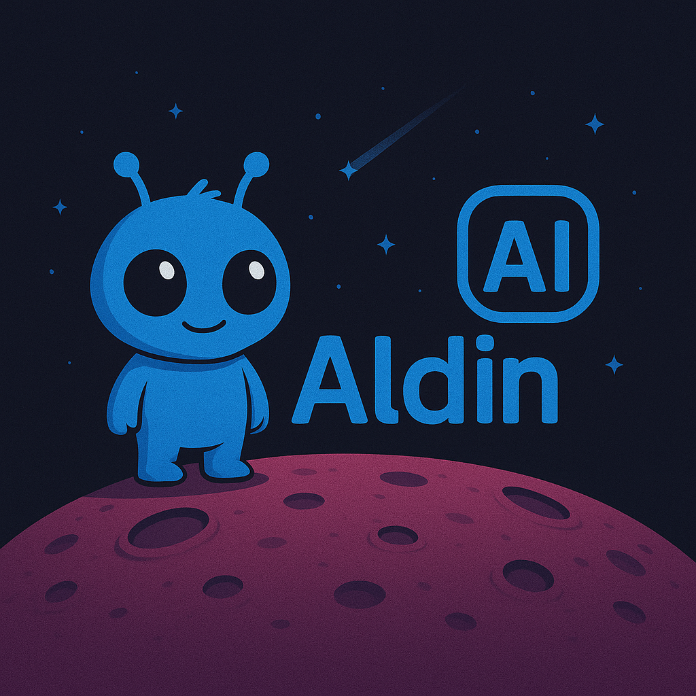

# Aldin AI  🚀  

*Accelerating AI use for Data, Companies & Learners*  

---

## 1. Who We Are
Aldin AI LLC (White Lake, MI) is a founder-led, pre-seed startup building privacy-first generative-AI products that unlock sensitive data and personalize learning—all while respecting governance, safety, and culture.

* **Founder** – Salah A. Mokhayesh (20-year data-architecture & governance veteran; ex-GM, OnStar, Rocket Mortgage)  
* **Mission** – Deliver ethical, high-impact AI from prototype to production. Aldin AI is not only a think tank but an **execution hub** on the most relevant ways to utilize AI.

---

## 2. Flagship Projects

| Project | One-liner | Tech Highlights |
|---------|-----------|-----------------|
| **Project Genesis** (formerly *Nexus*) | Lake-native engine that auto-curates schemas, generates privacy-preserving synthetic data, and redistributes it back to S3. | Python, PyTorch, AWS (S3, Lambda), differential privacy, GAN/transformer synthesis, schema-aware validation |
| **Project ASHER** | Speech-enabled K-12 assistant with avatar, cultural safeguards, and test-prep alignment (MEAP, ACT, SAT). | LLM fine-tuning, vector knowledge-base, TTS/STT, parental content filters, future AR/hologram interface |

---

## 3. Repo Contents

